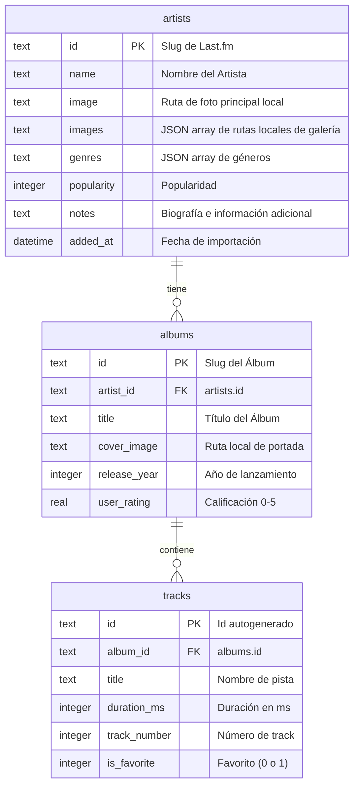

# 🎵 MusicTracker — Tu Colección Musical Personal

**MusicTracker** es una aplicación de escritorio/servidor web construida con Node.js, Express y SQLite que te permite realizar un seguimiento personalizado de tus artistas, álbumes y canciones favoritas. Consigue toda la información de forma gratuita mediante técnicas avanzadas de scraping web desde **Last.fm en español**, incluyendo biografías completas, discografías y portadas de discos.

---

## 🎨 Características Principales

*   **🕵️ Scraping de Last.fm:** Obtiene biografías completas en español, discografías y listados de tracks sin necesidad de usar APIs de terceros ni tokens.
*   **💾 Almacenamiento Local de Imágenes:** Descarga automáticamente fotos de artistas y portadas de álbumes a máxima resolución (`ar0`) en la carpeta pública local, evitando enlaces rotos externos.
*   **🖼️ Galería Masonry estilo Pinterest:** En el perfil del artista se despliega una grilla dinámica responsiva de 5 columnas basada en la librería Masonry. Incluye efectos hover premium y un visor modal (Lightbox) interactivo con cierre al hacer clic fuera, navegación por teclado (`←` y `→`) y botón para abrir fotos en una pestaña nueva.
*   **🔍 Búsqueda Dinámica con Skeleton Loaders:** Interfaz de búsqueda interactiva basada en AJAX que renderiza placeholders de carga animados (Skeleton Loaders) sin recargas completas de página.
*   **⚡ Cacheo de Portadas Fallidas (Cover Art Archive):** Marcado automático de imágenes inexistentes con el valor centinela `'NO_COVER'` para evitar peticiones HTTP 404 redundantes y acelerar las sincronizaciones de álbumes consecutivas.
*   **📊 Sistema de Logs Persistentes:** Registros secuenciales explícitos impresos en consola y guardados localmente en [logs/importaciones.log](file:///home/juan/Documentos/Dev/Apps/MusicTracker/logs/importaciones.log) con formato de hora regional (es_AR) para auditar importaciones de artistas y álbumes.
*   **🗄️ SQLite local:** Utiliza la base de datos `better-sqlite3` para un rendimiento asombroso y transacciones ACID que garantizan la consistencia de datos durante la importación.
*   **⭐ Calificación Interactiva y Favoritos:** Permite puntuar álbumes (0 a 5 estrellas) de forma interactiva con efecto hover estilo ShowTracker, y marcar pistas como favoritas mediante solicitudes asíncronas (AJAX).
*   **🔴 UI Premium en Modo Oscuro:** Interfaz moderna con Bootstrap 5.3, glassmorphism, sombras sutiles y acentos en rojo marca.

---

## 🛠️ Stack Tecnológico

*   **Backend:** Node.js, Express.js
*   **Base de Datos:** SQLite (`better-sqlite3`)
*   **Scraping:** Axios, Cheerio
*   **Frontend:** HTML5, EJS, Bootstrap 5.3 (Modo Oscuro), Bootstrap Icons

---

## 📁 Estructura del Proyecto

*   **[app.js](file:///home/juan/Documentos/Dev/Apps/MusicTracker/app.js):** Punto de entrada del servidor Express.
*   **[db.js](file:///home/juan/Documentos/Dev/Apps/MusicTracker/db.js):** Inicialización del motor SQLite y definición del esquema de tablas.
*   **`services/`**
    *   **[services/lastfm.js](file:///home/juan/Documentos/Dev/Apps/MusicTracker/services/lastfm.js):** Scraper asíncrono para Last.fm (perfil, búsqueda, wiki e imágenes).
    *   **[services/imageDownloader.js](file:///home/juan/Documentos/Dev/Apps/MusicTracker/services/imageDownloader.js):** Descargador y limpiador de archivos físicos de imágenes.
*   **`routes/`**
    *   **[routes/index.js](file:///home/juan/Documentos/Dev/Apps/MusicTracker/routes/index.js):** Ruta del Dashboard.
    *   **[routes/artists.js](file:///home/juan/Documentos/Dev/Apps/MusicTracker/routes/artists.js):** Rutas de búsqueda, importación recursiva y notas.
    *   **[routes/albums.js](file:///home/juan/Documentos/Dev/Apps/MusicTracker/routes/albums.js):** Ruta de calificaciones de álbumes.
    *   **[routes/tracks.js](file:///home/juan/Documentos/Dev/Apps/MusicTracker/routes/tracks.js):** Ruta de favoritos de canciones.
*   **`views/`**
    *   **[views/index.ejs](file:///home/juan/Documentos/Dev/Apps/MusicTracker/views/index.ejs):** Vista principal con la rejilla responsiva de artistas seguidos.
    *   **[views/artist.ejs](file:///home/juan/Documentos/Dev/Apps/MusicTracker/views/artist.ejs):** Vista del perfil detallado del artista con su biografía, galería interactiva y discografía.
    *   **[views/search.ejs](file:///home/juan/Documentos/Dev/Apps/MusicTracker/views/search.ejs):** Vista del buscador de artistas en Last.fm.

---

## ⚙️ Instalación y Uso

1.  **Clonar el repositorio:**
    ```bash
    git clone <url-del-repositorio>
    cd MusicTracker
    ```

2.  **Instalar dependencias:**
    ```bash
    npm install
    ```

3.  **Configurar variables de entorno:**
    Crear un archivo `.env` en el directorio raíz:
    ```text
    PORT=3000
    ```

4.  **Iniciar en modo de desarrollo:**
    ```bash
    npm run dev
    ```

5.  **Acceder a la aplicación:**
    Abrir en el navegador: `http://localhost:3000`

---

## 🗄️ Esquema de la Base de Datos



---

## 🚀 Historial de Versiones

### v1.28.0 (Actual)
*   **🔒 Servidor HTTPS Nativo:** Integración de certificados SSL (`apache.key` y `apache.crt`) en el inicio de la aplicación en `app.js` usando los módulos nativos `https` y `fs` de Node.js, para servir la plataforma de forma segura a través de `https://localhost:3000`.
*   **📂 Depuración y Traslado de Fotos Huérfanas:** Implementación de un botón "Mover Huérfanas" en la interfaz de estadísticas y una ruta backend `POST /stats/move-orphans`. Escanea los directorios locales de imágenes y traslada aquellos archivos sin correspondencia en la base de datos de SQLite a una carpeta de resguardo `/huerfanas/` en la raíz del proyecto sin eliminarlos.
*   **🏳️ Catálogo de Banderas y Países Enriquecido:** Se añadieron más de 45 países y banderas emojis unicode al dropdown del Dashboard. Además, se configuraron sinónimos en el backend (`services/flagHelper.js`) para Moldavia, Congo y República Democrática del Congo (DRC) para evitar banderas vacías.
*   **🐛 Corrección de Bloqueo de Scripts en Estadísticas:** Se validó la existencia de los inputs de restauración (`restoreInput`) antes de asignarles event listeners, solucionando un fallo por `TypeError` en el DOM que impedía que otros botones (como "Fotos B&W") funcionaran en el cliente.

### v1.27.0
*   **⌨️ Atajo de teclado para eliminar imágenes en el Lightbox:** Permite borrar la foto actual de la galería al presionar la tecla `d` o `D` con el visor de fotos abierto, previniendo la acción si el foco está en un campo de texto para mayor seguridad y accesibilidad.
*   **📐 Alineación y centrado de botones en estadísticas:** Optimización de la interfaz en la sección de Mantenimiento de Datos de la vista de estadísticas. Se corrigieron los paddings rotos (de `-3` a `p-3`), y se alinearon vertical (`align-items-center`) e hicieron centrado horizontal (`justify-content-center`) de todos los botones de acción para un acabado visual homogéneo.

### v1.26.0
*   **⚙️ Importaciones asíncronas en segundo plano (Background Worker):** Incremento de la versión MINOR. Rediseño completo de la importación masiva de artistas desde archivos de texto. El proceso se delegó a un worker en segundo plano que consume una cola transaccional en SQLite, permitiendo cerrar el modal e incluso la pestaña del navegador sin interrumpir las importaciones en curso.
*   **🎨 Detección de fotos en blanco y negro (B&W) en galerías:** Integración de un analizador cromático en el cliente que escanea la galería de fotos locales de todos los artistas utilizando Canvas HTML5. Evalúa la saturación cromática pixel por pixel en lotes de 6 tareas paralelas a baja resolución ($30 \times 30$ px) para ahorrar memoria, y lista los artistas detectados mostrando una miniatura de la foto en escala de grises.

### v1.25.0
*   **🖼️ Borrado continuo en Lightbox:** Se modificó el comportamiento de eliminación de imágenes en el visor Lightbox; ahora no se cierra el modal, sino que avanza y renderiza de forma automática la siguiente foto disponible de la galería, ocultándose únicamente si la galería se queda completamente vacía.
*   **🐛 Comprobación de duplicados por TXT sin acentos:** Se corrigieron las rutas `/artists/batch-check` y `/artists/batch-add` para comparar los nombres de los artistas en lote utilizando la normalización `removeAccents()`. Esto soluciona los problemas donde artistas con diferencias únicamente en marcas diacríticas (como "Andres Calamaro" y "Andrés Calamaro") no eran catalogados como duplicados.
*   **🚩 Banderas de Egipto y Filipinas:** Se añadió soporte en `services/flagHelper.js` y en el Dashboard para traducir, mapear y visualizar las banderas de Egipto (`🇪🇬`) y Filipinas (`🇵🇭`) en las tarjetas y en el selector de filtros de países.
*   **📂 Reubicación de filtro "Sin Datos":** Se reordenó el dropdown de países de la pantalla de inicio para posicionar la opción "Sin datos" en segundo lugar (inmediatamente después de "Todos los países"), agilizando la depuración de artistas sin ubicación registrada.

### v1.24.0
*   **🔤 Tarjetas de iniciales en Dashboard:** Se inyectaron tarjetas cuadradas con diseño de vidrio esmerilado, borde rojo de marca y letras a gran escala (`5.5rem`) como separadores visuales alfabéticos dentro de la grilla de artistas del inicio.
*   **⚡ Scroll y Filtrado inteligente de iniciales:** Se sincronizó el abecedario flotante para que apunte y resalte con un borde parpadeante rojo a la tarjeta de la inicial al hacer clic. Además, el script asíncrono de filtrado oculta automáticamente los separadores vacíos cuando no hay artistas correspondientes en pantalla.

### v1.23.0
*   **🔗 Enlaces y reproducción rápida de Artista:** Se incorporaron botones estilizados de tamaño `32px` con los logos vectoriales locales (`lastfm.svg`, `spotify.svg` y `youtube.svg`) al lado del nombre del artista en su ficha de detalles, permitiendo visitar su perfil de Last.fm o buscar al artista en Spotify y YouTube.
*   **🎵 Iconos SVG de reproducción en Álbumes:** Se rediseñó el acceso a reproductores en la grilla de álbumes reemplazando los iconos genéricos por los SVG locales de Spotify y YouTube, escalados a `32px` para mayor visibilidad, e integrando efectos hover premium simétricos de escala y rotación.

### v1.22.2
*   **⚡ Lazy Loading en Dashboard:** Se implementó la carga diferida nativa (`loading="lazy"` y `decoding="async"`) en las imágenes de la grilla de artistas del inicio, combinándolo con un efecto de transición CSS de fade-in progresivo (`opacity` de 0 a 1) al finalizar la carga física del archivo para optimizar el rendimiento y la fluidez visual de la página.

### v1.22.1
*   **🎨 Efecto Hover en Abecedario:** Se redujo el tamaño de fuente y del botón del abecedario flotante por defecto. Al pasar el cursor por encima, la letra se magnifica tres veces (`scale(3)`) con una animación fluida sobre un círculo de fondo rojo translúcido al 75% de opacidad para mejorar el realce visual.

### v1.22.0
*   **🔤 Abecedario flotante en Dashboard:** Se incorporó un abecedario flotante vertical en el margen derecho de la pantalla principal, posicionado fuera del contenedor de tarjetas de artistas, con botones estilizados de tamaño optimizado para facilitar el desplazamiento rápido y mejorar la navegación de usuarios con visión reducida.
*   **📂 Opción "Sin Datos" en filtro de países:** Se agregó la opción "Sin datos" al selector dropdown del Dashboard para filtrar y listar rápidamente aquellos artistas que no tienen un país de origen cargado.
*   **📊 Sección "Sin Fotos" y Descarga en lote:** En la página de estadísticas se añadió una tarjeta indicadora con la cantidad de artistas sin imágenes en su galería que abre un modal con el listado detallado de los mismos. Además, se implementó un botón para iniciar la descarga y sincronización de álbumes en lote con un modal que reporta el progreso en tiempo real.
*   **🐛 Robustez con caracteres especiales (`&` y acentos):** Se solucionaron las discrepancias de ruteo y codificación en nombres de artistas que contienen el carácter ampersand `&` o letras acentuadas (como "Guns N' Roses" o artistas con tildes), implementando una búsqueda adaptativa en el backend que prueba múltiples variaciones del identificador.
*   **🚩 Nuevas banderas de origen:** Se extendió el mapeo y soporte de banderas en `services/flagHelper.js` incorporando Irlanda, Puerto Rico, Suiza, Nigeria, Serbia y Tanzania, solucionando asimismo la visualización de la bandera de Irlanda en el menú desplegable.
*   **🎨 Botones Outline en mantenimiento:** Se actualizaron los botones de acción en la sección "Mantenimiento de Datos" de estadísticas para usar estilos outline de Bootstrap, logrando una estética visual más limpia y uniforme.

### v1.21.0
*   **🌎 Filtrado por países en Dashboard:** Se incorporó un selector dropdown (`select`) estético con efecto de vidrio esmerilado (`glassmorphism`) al lado de la barra de búsqueda. Lista dinámicamente los países de origen presentes en la colección del usuario con su respectiva bandera emoji y la cantidad de artistas registrados por país, ordenándose de mayor a menor cantidad de forma automática. Permite filtrar simultáneamente con la búsqueda de texto y actualiza el contador de artistas en tiempo real.
*   **⚡ Optimización en Importación en Lote:** Se modificó la importación en lote (`POST /batch-add`) para verificar primero de forma local y asíncrona la existencia del artista en SQLite por su nombre (insensible a mayúsculas/minúsculas). Si ya existe, se omite el cooldown de espera de 15 segundos y la llamada redundante a Last.fm, agilizando drásticamente el proceso.
*   **🔄 Actualización de Galería siempre visible:** El panel de fotos ahora se muestra de forma permanente en la vista del artista. Se agregó el botón "Actualizar Galería" para forzar de forma asíncrona (`fetch`) la sincronización de imágenes desde Last.fm y reconstruir la grilla de Masonry en caliente sin recargar la página.

### v1.20.0
*   **🗑️ Borrado de fotos asíncrono y silencioso:** Se implementó un botón "Borrar Foto" en el Lightbox de la galería al lado de "Abrir en pestaña nueva". Al hacer clic, elimina de forma directa la imagen física del disco local y los registros en SQLite usando peticiones asíncronas (`fetch`) sin pedir confirmación ("sin preguntar") y actualizando la interfaz y la grilla Masonry dinámicamente ("sin recargar"). Si la foto eliminada era la principal, se reasigna la siguiente disponible o se restablece el avatar predeterminado de forma fluida.

### v1.19.0
*   **📝 Ficha Técnica Editable:** Se implementó la edición manual para los campos de la ficha técnica del artista (Formado en, Fecha de nacimiento, Lugar de nacimiento, Años de actividad, Fallecido). Los cambios se guardan de forma asíncrona (`fetch`) y actualizan el bloque lateral sin perder otros metadatos (como miembros de bandas), forzando el recargo para actualizar la bandera asociada.

### v1.18.1
*   **🐛 Correcciones en Banderas y Mapeos:** Se agregaron e integraron las banderas oficiales de China (`china.png`) e Italia (`italia.png`) en tamaño adaptado. Se corrigió un espacio en el nombre de la bandera de Ascensión y se renombró la de Tristán de Acuña a caracteres ASCII (`tristandeacuna.png`) para resolver la coincidencia con el normalizador. Asimismo, se robustecieron las equivalencias de mapeo en el helper para Bosnia y Herzegovina.

### v1.18.0
*   **🖼️ Selección de Foto Principal:** Se agregó un botón en la barra inferior del Lightbox de fotos del artista ("Usar como foto principal") al lado de "Abrir en pestaña nueva". Al hacer clic, se actualiza de forma asíncrona (`fetch`) la imagen del artista en SQLite y en la interfaz (perfil lateral) sin recargar la página.

### v1.17.0
*   **🚩 Insignias de banderas de países:** Se implementó un sistema inteligente para mostrar la bandera del país de nacimiento o formación del artista.
*   **🖼️ Superposición sobre la foto de perfil:** Las banderas se muestran superpuestas en la esquina inferior derecha de la foto principal del artista dentro de un círculo negro translúcido con borde rojo.
*   **🏠 Integración en el Dashboard:** Las insignias de banderas circulares de tamaño adaptado se muestran en cada tarjeta de artista en la grilla del inicio (Dashboard).
*   **🧩 Refactorización a Helper Compartido:** Se centralizó la lógica en [services/flagHelper.js](file:///home/juan/Documentos/Dev/Apps/MusicTracker/services/flagHelper.js) para normalizar ubicaciones, traducir/mapear variantes comunes (Reino Unido, Federación Rusa, etc.) y validar la existencia física del archivo.
*   **🐛 Corrección de coincidencias cortas:** Se aplicaron límites de palabra (`\b`) en las coincidencias de abreviaciones cortas para evitar falsos positivos (como asignar la bandera estadounidense a t.A.T.u. por contener "us" en "rusa").

### v1.16.1
*   **🐛 Corrección en parsing de géneros (Last.fm):** Se corrigió el selector del extractor de tags/géneros en Last.fm para apuntar a `a[href*="/tag/"]`, solucionando el problema donde los géneros aparecían vacíos en la base de datos y la sección de estadísticas.
*   **🎨 Diseño de insignias en rojo:** Se rediseñaron los badges de géneros musicales en la ficha de detalles del artista a un tono de acento rojo de alto contraste para mejorar la lectura y coherencia visual.

### v1.16.0
*   **🖼️ Galería Masonry estilo Pinterest:** Rediseño completo de la galería de fotos a un esquema Pinterest con la librería `masonry-layout` y `imagesloaded` que soporta 5 columnas fluidas.
*   **👁️ Visor Lightbox Mejorado:** Se integró un modal Lightbox de alto contraste con atenuación de fondo y desenfoque (Blur), soporte para navegación por teclado, cierre inteligente al hacer clic en zonas vacías externas y botón directo de apertura externa en pestaña nueva.

### v1.15.0
*   **📂 Logs Persistentes en Archivo:** Implementación de un servicio de logging personalizado (`services/logger.js`) que escribe todos los eventos de importación y sincronización en un archivo local (`logs/importaciones.log`) con fecha/hora local de Argentina, además de imprimirlos en la consola del servidor. Se añadió la exclusión de esta carpeta en `.gitignore`.

### v1.14.0
*   **📊 Logs Detallados de Carga:** Inyección de logs explícitos en la consola del backend (`[Importador]`, `[Sincronizador]`, `[Batch]`) que permiten hacer un seguimiento y monitorear paso a paso la importación individual, la importación en lote y la sincronización de álbumes.
*   **🔍 Búsqueda Dinámica con Skeleton Loaders:** Se implementó una interfaz asíncrona de búsqueda mediante AJAX en Last.fm que renderiza Skeleton Loaders animados (estructura de carga) sin recargar la página.
*   **⚡ Cacheo de Portadas Fallidas (Cover Art Archive):** Almacenamiento local de portadas inexistentes bajo el identificador `'NO_COVER'` para prevenir consultas HTTP redundantes 404 y acelerar drásticamente los tiempos de sincronización subsiguientes.

### v1.13.1
*   **🖼️ Contador de Fotos en Galería:** Se incorporó un badge circular dinámico al lado del título "Fotos" en la vista detallada del artista para cuantificar y mostrar la cantidad exacta de imágenes cargadas en su galería.

### v1.13.0
*   **🔍 Filtro de Artistas en Inicio:** Se implementó una barra de búsqueda en la cabecera del Dashboard principal para filtrar artistas en tiempo real sin recargar la página. Incluye un mensaje de advertencia visual interactivo si no hay coincidencias.

### v1.12.1
*   **🎨 Rediseño e Integración de Metadatos:** Se reubicó la caja de datos adicionales del artista justo debajo de los géneros y antes de la biografía, removiendo el encabezado "Ficha Técnica". La información ahora se integra en un bloque estético con fondo translúcido (`bg-dark bg-opacity-25`).

### v1.12.0
*   **📋 Ficha Técnica de Metadatos del Artista:** Se integró la extracción y persistencia de información extendida desde la Wiki de Last.fm, mostrando los campos *Años de actividad*, *Formado en*, *Miembros*, *Fecha de nacimiento*, *Lugar de nacimiento* y *Fallecido* (según disponibilidad). Los datos se almacenan como JSON en una nueva columna `metadata` en SQLite y se visualizan elegantemente en la barra lateral del artista.

### v1.11.2
*   **⚡ Borrado de Álbumes Asíncrono (AJAX):** El borrado de álbumes sin calificar se realiza de forma asíncrona sin pedir confirmación ni recargar la página. La fila del álbum se remueve dinámicamente con una animación de escala y opacidad, actualizando también el contador del badge de álbumes en tiempo real.

### v1.11.1
*   **🗑️ Borrado Individual de Álbumes sin Calificar:** Se reemplazó la eliminación en lote por un botón de tachito de basura individual al lado de la calificación de cada álbum sin puntuar, permitiendo una limpieza selectiva de la discografía.
*   **🎶 Flexibilización de Importación de Álbumes:** Ahora se importan álbumes sin calificación comunitaria si poseen más de 7 pistas (por ejemplo, "Unlocked" de Alexandra Stan).
*   **🔌 Robustez en Importador:** Se incorporó el reemplazo `_SLASH_` para solucionar los problemas de ruteo de artistas que tienen caracteres de barra diagonal (ej. "AC/DC"), se limitó la galería de fotos a 40 imágenes por artista para prevenir fallos de red y se aumentó el timeout de importación a 3 minutos.

### v1.11.0
*   **🌐 Importador Híbrido Last.fm + MusicBrainz:** Implementación de un flujo de importación híbrido que extrae biografías y fotos del artista desde Last.fm, y toda la discografía, tracks, duraciones, portadas de Cover Art Archive y calificaciones oficiales desde MusicBrainz.org.
*   **🎯 Filtro de Álbumes Selectivos:** Se restringe la descarga únicamente a álbumes de estudio convencionales y en vivo (*Live*), omitiendo recopilaciones, remixes, singles y EPs.
*   **⭐ Exclusión de Álbumes sin Calificar:** Se omiten automáticamente los álbumes que no cuentan con calificación de la comunidad.
*   **♾️ Importación sin Límites:** Se removió el límite de 10 álbumes, permitiendo procesar toda la discografía necesaria.

### v1.10.2
*   **🐛 Corrección en Descarga de Imágenes:** Incremento del retardo entre descargas consecutivas de imágenes de la galería del artista a 1 segundo para prevenir bloqueos por tasa de peticiones y errores de timeout (`timeout of 10000ms exceeded`).

### v1.10.1
*   **🔄 Apertura Híbrida de Spotify:** Refinación del botón de Spotify para que intente abrir la aplicación nativa local (`spotify:search:...`) con fallback automático a la versión web en una nueva pestaña si el navegador no pierde el foco en 1.2 segundos.

### v1.10.0
*   **🟢 Integración con Spotify:** Se agregó un botón de enlace directo a Spotify (`bi-spotify`) al lado de cada álbum. Al hacer clic, abre la búsqueda del álbum en una pestaña nueva con un efecto de hover premium animado (escala y rotación de 8 grados).

### v1.9.0
*   **📥 Importador en Lote por TXT:** Se implementó una nueva herramienta en la página de estadísticas para subir un archivo de texto con nombres de artistas, procesarlos asíncronamente con un retardo de 15 segundos entre peticiones para evitar bloqueos y visualizar un reporte de progreso interactivo y detallado en tiempo real.
*   **🖱️ Título de Álbum Interactivo:** Al hacer clic sobre el nombre del álbum en el perfil de detalles del artista, se despliega el modal de canciones al igual que al clickear sobre la portada.

### v1.8.0
*   **📖 Estructuración de Biografías:** Se implementó una segmentación automática en párrafos balanceados cada 3 oraciones y se aplicó un estilo CSS tipográfico premium con una letra capitular coloreada y con sombra al inicio de la biografía.
*   **🔤 Orden Alfabético de Artistas:** Se modificó la consulta del Dashboard principal para mostrar a los artistas ordenados de forma alfabética de manera insensible a mayúsculas/minúsculas (`COLLATE NOCASE`).

### v1.7.0
*   **📊 Página de Estadísticas:** Nueva sección dedicada que agrupa el volumen total de artistas, álbumes, pistas, canciones favoritas, y métricas avanzadas como el promedio de tracks por álbum y la duración acumulada total de la discografía.
*   **💾 Copias de Seguridad tar.gz:** Implementación de respaldos en caliente que empaquetan la base de datos en formato JSON y todas las imágenes locales en un archivo comprimido `.tar.gz` con la fecha en el nombre.
*   **🐛 Prevención de Reinicios de Nodemon:** Migración completa de los archivos temporales y operaciones de compresión/extracción al directorio temporal del sistema operativo (`os.tmpdir()`), solucionando el corte de conexión (`ERR_EMPTY_RESPONSE`) provocado por el reinicio del monitor del servidor.

### v1.6.0
*   **🏷️ Simplificación de Etiquetas:** Se renombró "Galería de Fotos" a "Fotos" y "Discografía y Canciones" a "Albums" para una interfaz de usuario más directa y despejada.
*   **🌟 Metadatos en Detalle de Álbum:** Al abrir el modal de un álbum, se incorporó el año de lanzamiento y la calificación por estrellas al lado del título del álbum.

### v1.5.0
*   **🎶 Visualización Integrada de Canciones:** Se eliminó el acordeón de la discografía principal para un diseño más limpio y se reubicó la lista de tracks directamente dentro de la ventana modal de visualización de la portada del álbum. Las canciones se inyectan dinámicamente con codificación Base64 a prueba de comillas y caracteres UTF-8 especiales, y los favoritos se alternan asíncronamente mediante AJAX.
*   **📝 Recorte y Reubicación de Biografía:** Se reubicó la biografía del artista del bloque de la derecha a la columna lateral izquierda entre el nombre y el botón de borrar, recortándose dinámicamente a las primeras 20 palabras con un enlace interactivo de "Leer más" para abrir la biografía completa en un modal.
*   **⭐ Calificaciones Fijas:** Las estrellas de calificación de los álbumes pasaron a ser fijas y de solo lectura en la interfaz de usuario, indicando el puntaje mediante tooltips estáticos.
*   **🔇 Servidor de Arranque Silencioso:** Se eliminó el modo verbose SQL de la consola al iniciar el servidor para un arranque limpio.
*   **🖼️ Inicio de Galería Personalizado:** La galería de imágenes interactiva ahora inicia por defecto mostrando la segunda foto del artista si tiene más de una imagen.
*   **🐛 Correcciones Generales:** Se solucionaron errores del ReferenceError de `formatDuration`, bugs de asignación en la actualización de calificaciones desde MusicBrainz y compatibilidad de caracteres de URL con Guns N' Roses.

### v1.4.0
*   **🖼️ Visor de Portadas Ampliadas:** Las imágenes de portada de los álbumes en la vista de detalles ahora son interactivas y se abren en un visor modal de alta resolución al hacer clic sobre ellas.
*   **⚡ Optimización de Carga:** Se difirió la inicialización de Bootstrap en el frontend al evento `DOMContentLoaded` para evitar errores de ciclo de vida de los scripts de terceros y asegurar total disponibilidad.
*   **🔍 Ajuste en Buscador:** Se normalizó el tamaño del cuadro de texto e input de búsqueda de artistas para lograr una interfaz de uso más compacta.

### v1.3.0
*   **🔗 Enlaces a Last.fm:** Los nombres de los artistas en los resultados de búsqueda ahora sirven como enlaces directos a sus perfiles de Last.fm en español, abriéndose en una pestaña nueva e incorporando un indicador visual.
*   **📅 Orden de Discografía:** Se reestructuró la consulta de detalles para ordenar los álbumes de forma cronológica ascendente (del más antiguo al más nuevo), manteniendo elegantemente al final de la lista los álbumes que no tengan año de lanzamiento registrado.


### v1.2.0
*   **⭐ Calificación Interactiva:** Calificación de álbumes mediante un visor de estrellas interactivo con efectos de hover (guardado instantáneo vía AJAX, estilo *ShowTracker*).
*   **📅 Año de Lanzamiento:** Inclusión del año de lanzamiento de cada álbum al lado de su título en la discografía (extraído automáticamente de Last.fm).
*   **🔍 Búsqueda Optimizada:** Autofoco automático en la caja de texto de búsqueda al abrir la pantalla para agilizar el flujo de uso.

---

Desarrollado con ❤️ por **Juan Gabriel Maioli**.


