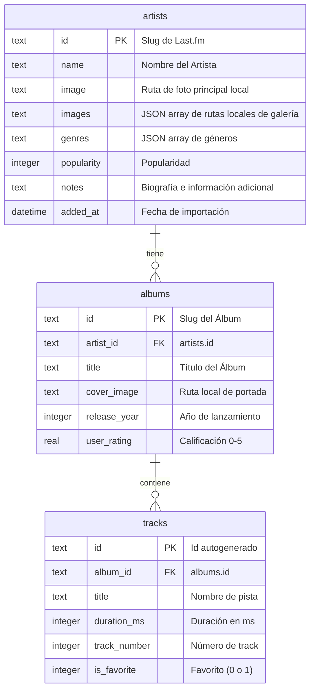

# 🎵 MusicTracker — Tu Colección Musical Personal

**MusicTracker** es una aplicación de escritorio/servidor web construida con Node.js, Express y SQLite que te permite realizar un seguimiento personalizado de tus artistas, álbumes y canciones favoritas. Consigue toda la información de forma gratuita mediante técnicas avanzadas de scraping web desde **Last.fm en español**, incluyendo biografías completas, discografías y portadas de discos.

---

## 🎨 Características Principales

*   **🕵️ Scraping de Last.fm:** Obtiene biografías completas en español, discografías y listados de tracks sin necesidad de usar APIs de terceros ni tokens.
*   **💾 Almacenamiento Local de Imágenes:** Descarga automáticamente fotos de artistas y portadas de álbumes a máxima resolución (`ar0`) en la carpeta pública local, evitando enlaces rotos externos.
*   **🖼️ Galería Interactiva:** En la sección de detalles de cada artista se visualizan hasta 40 fotos en una galería interactiva con tira de miniaturas, visor principal de alta resolución y navegación por teclado (flechas `←` y `→`).
*   **🗄️ SQLite local:** Utiliza la base de datos `better-sqlite3` para un rendimiento asombroso y transacciones ACID que garantizan la consistencia de datos durante la importación.
*   **⭐ Calificación Interactiva y Favoritos:** Permite puntuar álbumes (0 a 5 estrellas) de forma interactiva con efecto hover estilo ShowTracker, y marcar pistas como favoritas mediante solicitudes asíncronas (AJAX).
*   **🔴 UI Premium en Modo Oscuro:** Interfaz moderna con Bootstrap 5.3, glassmorphism, sombras sutiles y acentos en rojo marca.

---

## 🛠️ Stack Tecnológico

*   **Backend:** Node.js, Express.js
*   **Base de Datos:** SQLite (`better-sqlite3`)
*   **Scraping:** Axios, Cheerio
*   **Frontend:** HTML5, EJS, Bootstrap 5.3 (Modo Oscuro), Bootstrap Icons

---

## 📁 Estructura del Proyecto

*   **[app.js](file:///home/juan/Documentos/Dev/Apps/MusicTracker/app.js):** Punto de entrada del servidor Express.
*   **[db.js](file:///home/juan/Documentos/Dev/Apps/MusicTracker/db.js):** Inicialización del motor SQLite y definición del esquema de tablas.
*   **`services/`**
    *   **[services/lastfm.js](file:///home/juan/Documentos/Dev/Apps/MusicTracker/services/lastfm.js):** Scraper asíncrono para Last.fm (perfil, búsqueda, wiki e imágenes).
    *   **[services/imageDownloader.js](file:///home/juan/Documentos/Dev/Apps/MusicTracker/services/imageDownloader.js):** Descargador y limpiador de archivos físicos de imágenes.
*   **`routes/`**
    *   **[routes/index.js](file:///home/juan/Documentos/Dev/Apps/MusicTracker/routes/index.js):** Ruta del Dashboard.
    *   **[routes/artists.js](file:///home/juan/Documentos/Dev/Apps/MusicTracker/routes/artists.js):** Rutas de búsqueda, importación recursiva y notas.
    *   **[routes/albums.js](file:///home/juan/Documentos/Dev/Apps/MusicTracker/routes/albums.js):** Ruta de calificaciones de álbumes.
    *   **[routes/tracks.js](file:///home/juan/Documentos/Dev/Apps/MusicTracker/routes/tracks.js):** Ruta de favoritos de canciones.
*   **`views/`**
    *   **[views/index.ejs](file:///home/juan/Documentos/Dev/Apps/MusicTracker/views/index.ejs):** Vista principal con la rejilla responsiva de artistas seguidos.
    *   **[views/artist.ejs](file:///home/juan/Documentos/Dev/Apps/MusicTracker/views/artist.ejs):** Vista del perfil detallado del artista con su biografía, galería interactiva y discografía.
    *   **[views/search.ejs](file:///home/juan/Documentos/Dev/Apps/MusicTracker/views/search.ejs):** Vista del buscador de artistas en Last.fm.

---

## ⚙️ Instalación y Uso

1.  **Clonar el repositorio:**
    ```bash
    git clone <url-del-repositorio>
    cd MusicTracker
    ```

2.  **Instalar dependencias:**
    ```bash
    npm install
    ```

3.  **Configurar variables de entorno:**
    Crear un archivo `.env` en el directorio raíz:
    ```text
    PORT=3000
    ```

4.  **Iniciar en modo de desarrollo:**
    ```bash
    npm run dev
    ```

5.  **Acceder a la aplicación:**
    Abrir en el navegador: `http://localhost:3000`

---

## 🗄️ Esquema de la Base de Datos



---

## 🚀 Historial de Versiones
 
### v1.12.1 (Actual)
*   **🎨 Rediseño e Integración de Metadatos:** Se reubicó la caja de datos adicionales del artista justo debajo de los géneros y antes de la biografía, removiendo el encabezado "Ficha Técnica". La información ahora se integra en un bloque estético con fondo translúcido (`bg-dark bg-opacity-25`).

### v1.12.0
*   **📋 Ficha Técnica de Metadatos del Artista:** Se integró la extracción y persistencia de información extendida desde la Wiki de Last.fm, mostrando los campos *Años de actividad*, *Formado en*, *Miembros*, *Fecha de nacimiento*, *Lugar de nacimiento* y *Fallecido* (según disponibilidad). Los datos se almacenan como JSON en una nueva columna `metadata` en SQLite y se visualizan elegantemente en la barra lateral del artista.

### v1.11.2
*   **⚡ Borrado de Álbumes Asíncrono (AJAX):** El borrado de álbumes sin calificar se realiza de forma asíncrona sin pedir confirmación ni recargar la página. La fila del álbum se remueve dinámicamente con una animación de escala y opacidad, actualizando también el contador del badge de álbumes en tiempo real.

### v1.11.1
*   **🗑️ Borrado Individual de Álbumes sin Calificar:** Se reemplazó la eliminación en lote por un botón de tachito de basura individual al lado de la calificación de cada álbum sin puntuar, permitiendo una limpieza selectiva de la discografía.
*   **🎶 Flexibilización de Importación de Álbumes:** Ahora se importan álbumes sin calificación comunitaria si poseen más de 7 pistas (por ejemplo, "Unlocked" de Alexandra Stan).
*   **🔌 Robustez en Importador:** Se incorporó el reemplazo `_SLASH_` para solucionar los problemas de ruteo de artistas que tienen caracteres de barra diagonal (ej. "AC/DC"), se limitó la galería de fotos a 40 imágenes por artista para prevenir fallos de red y se aumentó el timeout de importación a 3 minutos.

### v1.11.0
*   **🌐 Importador Híbrido Last.fm + MusicBrainz:** Implementación de un flujo de importación híbrido que extrae biografías y fotos del artista desde Last.fm, y toda la discografía, tracks, duraciones, portadas de Cover Art Archive y calificaciones oficiales desde MusicBrainz.org.
*   **🎯 Filtro de Álbumes Selectivos:** Se restringe la descarga únicamente a álbumes de estudio convencionales y en vivo (*Live*), omitiendo recopilaciones, remixes, singles y EPs.
*   **⭐ Exclusión de Álbumes sin Calificar:** Se omiten automáticamente los álbumes que no cuentan con calificación de la comunidad.
*   **♾️ Importación sin Límites:** Se removió el límite de 10 álbumes, permitiendo procesar toda la discografía necesaria.

### v1.10.2
*   **🐛 Corrección en Descarga de Imágenes:** Incremento del retardo entre descargas consecutivas de imágenes de la galería del artista a 1 segundo para prevenir bloqueos por tasa de peticiones y errores de timeout (`timeout of 10000ms exceeded`).

### v1.10.1
*   **🔄 Apertura Híbrida de Spotify:** Refinación del botón de Spotify para que intente abrir la aplicación nativa local (`spotify:search:...`) con fallback automático a la versión web en una nueva pestaña si el navegador no pierde el foco en 1.2 segundos.

### v1.10.0
*   **🟢 Integración con Spotify:** Se agregó un botón de enlace directo a Spotify (`bi-spotify`) al lado de cada álbum. Al hacer clic, abre la búsqueda del álbum en una pestaña nueva con un efecto de hover premium animado (escala y rotación de 8 grados).

### v1.9.0
*   **📥 Importador en Lote por TXT:** Se implementó una nueva herramienta en la página de estadísticas para subir un archivo de texto con nombres de artistas, procesarlos asíncronamente con un retardo de 15 segundos entre peticiones para evitar bloqueos y visualizar un reporte de progreso interactivo y detallado en tiempo real.
*   **🖱️ Título de Álbum Interactivo:** Al hacer clic sobre el nombre del álbum en el perfil de detalles del artista, se despliega el modal de canciones al igual que al clickear sobre la portada.

### v1.8.0
*   **📖 Estructuración de Biografías:** Se implementó una segmentación automática en párrafos balanceados cada 3 oraciones y se aplicó un estilo CSS tipográfico premium con una letra capitular coloreada y con sombra al inicio de la biografía.
*   **🔤 Orden Alfabético de Artistas:** Se modificó la consulta del Dashboard principal para mostrar a los artistas ordenados de forma alfabética de manera insensible a mayúsculas/minúsculas (`COLLATE NOCASE`).

### v1.7.0
*   **📊 Página de Estadísticas:** Nueva sección dedicada que agrupa el volumen total de artistas, álbumes, pistas, canciones favoritas, y métricas avanzadas como el promedio de tracks por álbum y la duración acumulada total de la discografía.
*   **💾 Copias de Seguridad tar.gz:** Implementación de respaldos en caliente que empaquetan la base de datos en formato JSON y todas las imágenes locales en un archivo comprimido `.tar.gz` con la fecha en el nombre.
*   **🐛 Prevención de Reinicios de Nodemon:** Migración completa de los archivos temporales y operaciones de compresión/extracción al directorio temporal del sistema operativo (`os.tmpdir()`), solucionando el corte de conexión (`ERR_EMPTY_RESPONSE`) provocado por el reinicio del monitor del servidor.

### v1.6.0
*   **🏷️ Simplificación de Etiquetas:** Se renombró "Galería de Fotos" a "Fotos" y "Discografía y Canciones" a "Albums" para una interfaz de usuario más directa y despejada.
*   **🌟 Metadatos en Detalle de Álbum:** Al abrir el modal de un álbum, se incorporó el año de lanzamiento y la calificación por estrellas al lado del título del álbum.

### v1.5.0
*   **🎶 Visualización Integrada de Canciones:** Se eliminó el acordeón de la discografía principal para un diseño más limpio y se reubicó la lista de tracks directamente dentro de la ventana modal de visualización de la portada del álbum. Las canciones se inyectan dinámicamente con codificación Base64 a prueba de comillas y caracteres UTF-8 especiales, y los favoritos se alternan asíncronamente mediante AJAX.
*   **📝 Recorte y Reubicación de Biografía:** Se reubicó la biografía del artista del bloque de la derecha a la columna lateral izquierda entre el nombre y el botón de borrar, recortándose dinámicamente a las primeras 20 palabras con un enlace interactivo de "Leer más" para abrir la biografía completa en un modal.
*   **⭐ Calificaciones Fijas:** Las estrellas de calificación de los álbumes pasaron a ser fijas y de solo lectura en la interfaz de usuario, indicando el puntaje mediante tooltips estáticos.
*   **🔇 Servidor de Arranque Silencioso:** Se eliminó el modo verbose SQL de la consola al iniciar el servidor para un arranque limpio.
*   **🖼️ Inicio de Galería Personalizado:** La galería de imágenes interactiva ahora inicia por defecto mostrando la segunda foto del artista si tiene más de una imagen.
*   **🐛 Correcciones Generales:** Se solucionaron errores del ReferenceError de `formatDuration`, bugs de asignación en la actualización de calificaciones desde MusicBrainz y compatibilidad de caracteres de URL con Guns N' Roses.

### v1.4.0
*   **🖼️ Visor de Portadas Ampliadas:** Las imágenes de portada de los álbumes en la vista de detalles ahora son interactivas y se abren en un visor modal de alta resolución al hacer clic sobre ellas.
*   **⚡ Optimización de Carga:** Se difirió la inicialización de Bootstrap en el frontend al evento `DOMContentLoaded` para evitar errores de ciclo de vida de los scripts de terceros y asegurar total disponibilidad.
*   **🔍 Ajuste en Buscador:** Se normalizó el tamaño del cuadro de texto e input de búsqueda de artistas para lograr una interfaz de uso más compacta.

### v1.3.0
*   **🔗 Enlaces a Last.fm:** Los nombres de los artistas en los resultados de búsqueda ahora sirven como enlaces directos a sus perfiles de Last.fm en español, abriéndose en una pestaña nueva e incorporando un indicador visual.
*   **📅 Orden de Discografía:** Se reestructuró la consulta de detalles para ordenar los álbumes de forma cronológica ascendente (del más antiguo al más nuevo), manteniendo elegantemente al final de la lista los álbumes que no tengan año de lanzamiento registrado.


### v1.2.0
*   **⭐ Calificación Interactiva:** Calificación de álbumes mediante un visor de estrellas interactivo con efectos de hover (guardado instantáneo vía AJAX, estilo *ShowTracker*).
*   **📅 Año de Lanzamiento:** Inclusión del año de lanzamiento de cada álbum al lado de su título en la discografía (extraído automáticamente de Last.fm).
*   **🔍 Búsqueda Optimizada:** Autofoco automático en la caja de texto de búsqueda al abrir la pantalla para agilizar el flujo de uso.

---

Desarrollado con ❤️ por **Juan Gabriel Maioli**.


