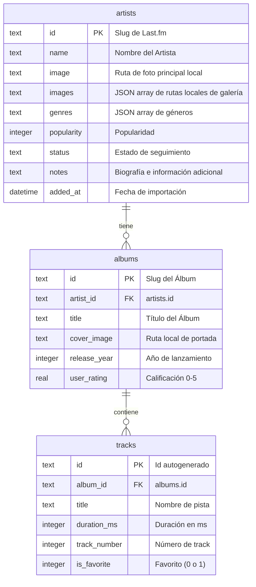

# 🎵 MusicTracker — Tu Colección Musical Personal

**MusicTracker** es una aplicación de escritorio/servidor web construida con Node.js, Express y SQLite que te permite realizar un seguimiento personalizado de tus artistas, álbumes y canciones favoritas. Consigue toda la información de forma gratuita mediante técnicas avanzadas de scraping web desde **Last.fm en español**, incluyendo biografías completas, discografías y portadas de discos.

---

## 🎨 Características Principales

*   **🕵️ Scraping de Last.fm:** Obtiene biografías completas en español, discografías y listados de tracks sin necesidad de usar APIs de terceros ni tokens.
*   **💾 Almacenamiento Local de Imágenes:** Descarga automáticamente fotos de artistas y portadas de álbumes a máxima resolución (`ar0`) en la carpeta pública local, evitando enlaces rotos externos.
*   **🖼️ Galería Interactiva:** En la sección de detalles de cada artista se visualizan hasta 40 fotos en una galería interactiva con tira de miniaturas, visor principal de alta resolución y navegación por teclado (flechas `←` y `→`).
*   **🗄️ SQLite local:** Utiliza la base de datos `better-sqlite3` para un rendimiento asombroso y transacciones ACID que garantizan la consistencia de datos durante la importación.
*   **⭐ Calificación Interactiva y Favoritos:** Permite puntuar álbumes (0 a 5 estrellas) de forma interactiva con efecto hover estilo ShowTracker, y marcar pistas como favoritas mediante solicitudes asíncronas (AJAX).
*   **🔴 UI Premium en Modo Oscuro:** Interfaz moderna con Bootstrap 5.3, glassmorphism, sombras sutiles y acentos en rojo marca.

---

## 🛠️ Stack Tecnológico

*   **Backend:** Node.js, Express.js
*   **Base de Datos:** SQLite (`better-sqlite3`)
*   **Scraping:** Axios, Cheerio
*   **Frontend:** HTML5, EJS, Bootstrap 5.3 (Modo Oscuro), Bootstrap Icons

---

## 📁 Estructura del Proyecto

*   **[app.js](file:///home/juan/Documentos/Dev/Apps/MusicTracker/app.js):** Punto de entrada del servidor Express.
*   **[db.js](file:///home/juan/Documentos/Dev/Apps/MusicTracker/db.js):** Inicialización del motor SQLite y definición del esquema de tablas.
*   **`services/`**
    *   **[services/lastfm.js](file:///home/juan/Documentos/Dev/Apps/MusicTracker/services/lastfm.js):** Scraper asíncrono para Last.fm (perfil, búsqueda, wiki e imágenes).
    *   **[services/imageDownloader.js](file:///home/juan/Documentos/Dev/Apps/MusicTracker/services/imageDownloader.js):** Descargador y limpiador de archivos físicos de imágenes.
*   **`routes/`**
    *   **[routes/index.js](file:///home/juan/Documentos/Dev/Apps/MusicTracker/routes/index.js):** Ruta del Dashboard.
    *   **[routes/artists.js](file:///home/juan/Documentos/Dev/Apps/MusicTracker/routes/artists.js):** Rutas de búsqueda, importación recursiva, estado de seguimiento y notas.
    *   **[routes/albums.js](file:///home/juan/Documentos/Dev/Apps/MusicTracker/routes/albums.js):** Ruta de calificaciones de álbumes.
    *   **[routes/tracks.js](file:///home/juan/Documentos/Dev/Apps/MusicTracker/routes/tracks.js):** Ruta de favoritos de canciones.
*   **`views/`**
    *   **[views/index.ejs](file:///home/juan/Documentos/Dev/Apps/MusicTracker/views/index.ejs):** Vista principal con la rejilla responsiva de artistas seguidos.
    *   **[views/artist.ejs](file:///home/juan/Documentos/Dev/Apps/MusicTracker/views/artist.ejs):** Vista del perfil detallado del artista con su biografía, galería interactiva y discografía.
    *   **[views/search.ejs](file:///home/juan/Documentos/Dev/Apps/MusicTracker/views/search.ejs):** Vista del buscador de artistas en Last.fm.

---

## ⚙️ Instalación y Uso

1.  **Clonar el repositorio:**
    ```bash
    git clone <url-del-repositorio>
    cd MusicTracker
    ```

2.  **Instalar dependencias:**
    ```bash
    npm install
    ```

3.  **Configurar variables de entorno:**
    Crear un archivo `.env` en el directorio raíz:
    ```text
    PORT=3000
    ```

4.  **Iniciar en modo de desarrollo:**
    ```bash
    npm run dev
    ```

5.  **Acceder a la aplicación:**
    Abrir en el navegador: `http://localhost:3000`

---

## 🗄️ Esquema de la Base de Datos



---

## 🚀 Historial de Versiones

### v1.4.0 (Actual)
*   **🖼️ Visor de Portadas Ampliadas:** Las imágenes de portada de los álbumes en la vista de detalles ahora son interactivas y se abren en un visor modal de alta resolución al hacer clic sobre ellas.
*   **⚡ Optimización de Carga:** Se difirió la inicialización de Bootstrap en el frontend al evento `DOMContentLoaded` para evitar errores de ciclo de vida de los scripts de terceros y asegurar total disponibilidad.
*   **🔍 Ajuste en Buscador:** Se normalizó el tamaño del cuadro de texto e input de búsqueda de artistas para lograr una interfaz de uso más compacta.

### v1.3.0
*   **🔗 Enlaces a Last.fm:** Los nombres de los artistas en los resultados de búsqueda ahora sirven como enlaces directos a sus perfiles de Last.fm en español, abriéndose en una pestaña nueva e incorporando un indicador visual.
*   **📅 Orden de Discografía:** Se reestructuró la consulta de detalles para ordenar los álbumes de forma cronológica ascendente (del más antiguo al más nuevo), manteniendo elegantemente al final de la lista los álbumes que no tengan año de lanzamiento registrado.


### v1.2.0
*   **⭐ Calificación Interactiva:** Calificación de álbumes mediante un visor de estrellas interactivo con efectos de hover (guardado instantáneo vía AJAX, estilo *ShowTracker*).
*   **📅 Año de Lanzamiento:** Inclusión del año de lanzamiento de cada álbum al lado de su título en la discografía (extraído automáticamente de Last.fm).
*   **🔍 Búsqueda Optimizada:** Autofoco automático en la caja de texto de búsqueda al abrir la pantalla para agilizar el flujo de uso.

---

Desarrollado con ❤️ por **Juan Gabriel Maioli**.


